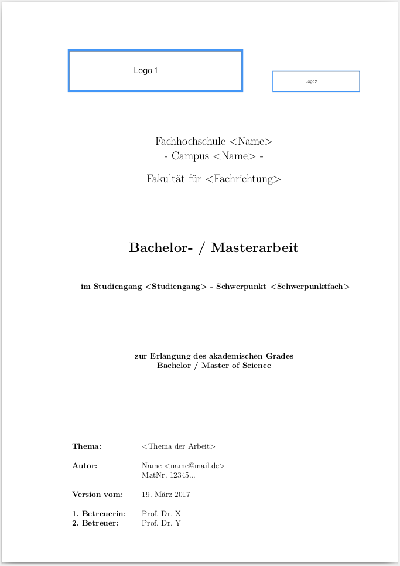

# latex-modelo-diplom-bachelor-mastertesina

Esta plantilla de LaTeX puede ser usada para informes técnicos, tesis de licenciatura o de maestría. Por favor, vea "[Hauptdatei.pdf](../../src/Hauptdatei.pdf)" como ejemplo.

## Uso

El archivo principal de la plantilla es el "[Hauptdatei.tex](../../src/Hauptdatei.tex)". Aquí se establecen los ajustes básicos de la plantilla y se incluyen los demás archivos. Puede ampliar estos archivos para su propio trabajo. Las sugerencias para las directivas LaTeX se pueden encontrar directamente en el código fuente de la plantilla.

El "[ejemplo.tex](../../src/ejemplo.tex)" muestra cómo las imágenes, referencias de imágenes, tablas, listados de código fuente, fórmulas matemáticas y notas a pie de página pueden ser usadas en LaTeX.

Además encontrarás varios marcadores de posición para los logos de tu universidad / colegio, tu nombre, profesores, número de matrícula, etc.

La plantilla utiliza las citas de la literatura alemana en la bibliografía de acuerdo con la norma alemana DIN 1505, parte 2 de enero de 1984 (véase [alphadin.bst](../../src/alphadin.bst)). Por favor, compruebe si este estilo de cita es aceptado por su instituto, lo que suele ser el caso para una tesis en lengua alemana.

## Codificación de caracteres

La plantilla utiliza el conjunto de caracteres generalmente recomendado UTF-8, por lo que puede utilizar directamente las diéresis alemanas ÄäÖööÜü y las comillas „“ en su código fuente.

## De LaTeX a PDF

Bajo "[scripts/generarPdf.sh](../../scripts/generarPdf.sh)" encontrará el script que a menudo puede ser usado directamente en sistemas operativos tipo unix (Linux, Mac) después de la instalación de una distribución TEX. Utilizando pdflatex, bibtex y makeindex se genera directamente desde la plantilla un PDF con la bibliografía y la lista de abreviaturas.

### Linux: Debian, Ubuntu, Linux Mint

Para las distribuciones de Linux basadas en Debian recomiendo la distribución TEX [TeX Live](http://www.tug.org/texlive/ "TeX Live") y el editor [Kile](http://kile.sourceforge.net/ "Kile").

Los siguientes enlaces te ayudarán a instalar el software en Ubuntu:
[Instalación de TeX Live](http://wiki.ubuntuusers.de/LATEX#TeX-Live "Instalación de TeX Live").
[Instalación de Kile](http://wiki.ubuntuusers.de/Kile "Instalación de Kile").

### Mac

En el Mac, una combinación de la distribución [MacTeX](http://www.tug.org/mactex/ "MacTeX") y el editor [TeXShop](http://pages.uoregon.edu/koch/texshop/ "TeXShop") ha demostrado ser muy útil. Una característica útil con esta combinación: Con CMD + clic izquierdo en un lugar del PDF se salta directamente al lugar correspondiente del código fuente de LaTeX en el editor.

### Windows

Bajo Windows yo personalmente usé [TeXlipse](http://texlipse.sourceforge.net/ "TeXlipse") (Eclipse Plugin para LaTeX) y el [TeXnicCenter](http://www.texniccenter.org/ "TeXnicCenter") como editor. Como distribución se puede utilizar [MikTeX](http://miktex.org/ "MikTeX").

### Docker

El entorno para crear archivos pdf puede ser ejecutado en un contenedor Docker. Para esta tarea, se puede utilizar el [Dockerfile](../../Dockerfile) proporcionado.

La imagen Docker puede ser creada con el comando `docker build -t maknesium/latexvorlage:latest`. Luego, el contenedor puede ser creado con el comando `docker run -d --name latexvorlage-container -v /pfad/zum/ordner/src:/app/src maknesium/latexvorlage:latest`. El contenedor no se borra después de terminar de compilar los archivos de texto y puede simplemente ser iniciado de nuevo para compilar los archivos de texto de nuevo con el comando `docker start latexvorlage-container`.

## Feedback

Si encuentra algún comentario, sugerencia de mejora y/o errores, por favor envíeme un mensaje:
contacto en el maknesium de

Alternativamente, aceptaré gustosamente las peticiones de atracción de Github.

¡Te deseo mucho éxito y diversión mientras escribes tu tesis con LaTeX!

# Licencia

Esta obra está licenciada bajo una licencia de Creative Commons Reconocimiento-No comercial-CompartirIgual 3.0 Alemania.
http://creativecommons.org/licenses/by-nc-sa/3.0/de/

# Cómprame un café!

Si la plantilla de látex te ahorró (mucho) tiempo, finalmente entregaste tu tesis y ahora sólo quieres devolver algo, eres bienvenido a invitarme a un café (o dos). Sí, me gusta el café :)

